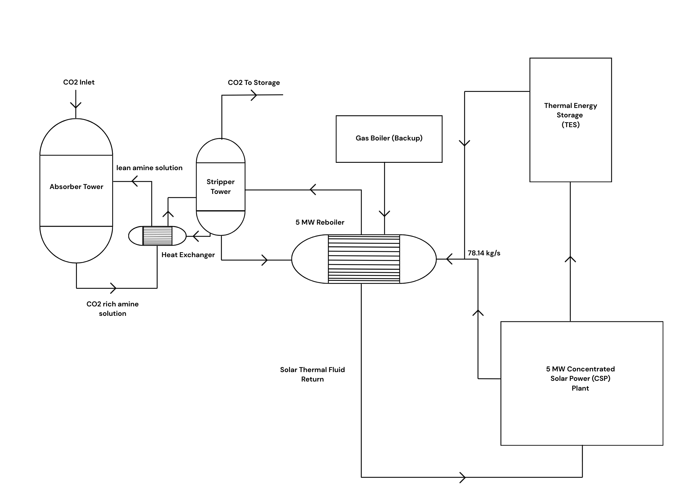
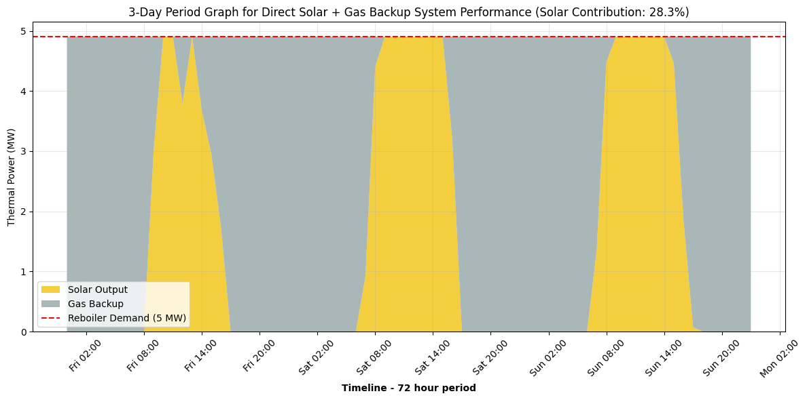
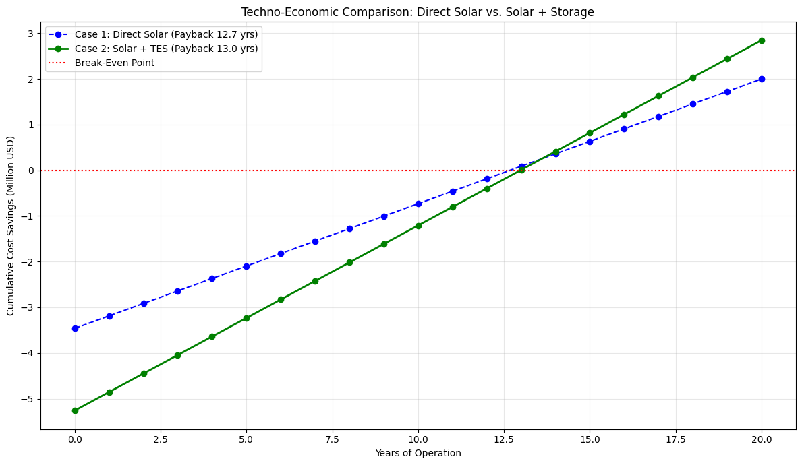

# Solar-Hybrid Solvent Regeneration System for Carbon Capture

<p align="center">

</p>

Inspired by the DENSYS Challenge-based Module titled “Carbon Capture Integrating Neutrality using Solar Storage Media with ArcelorMittal”, this project implements a physics-based hybrid simulation to optimize the decarbonization of industrial carbon capture processes. Utilizing the TESPy library for design-point sizing, the system incorporates a **5 MW solar-assisted reboiler** loop integrated with **60 MWh of Thermal Energy Storage (TES) and a backup gas boiler**. The optimized model achieves a **42.2% Solar Contribution** and a project payback period of **13 years**, proving the financial viability of renewable heat integration for amine-based CO2 stripping.


## 📌 Project Overview

Solvent-based carbon capture is energy-intensive, requiring significant heat for the regeneration of amine solvents (stripping CO2). Traditionally, this heat is supplied entirely by fossil fuel boilers, which subsequently generates more emissions.

This project addresses this challenge by designing a hybrid Solar Thermal System. It uses a physics-based thermodynamic model to size the solar field and storage to meet a 5 MW reboiler load at a controlled 120°C. The system uses a smart dispatch logic that prioritizes solar energy, stores excess heat in a storage tank, and only utilizes the gas boiler when renewable resources are exhausted.

## 🛠️ Technology Used

* **Thermodynamic Modeling:** TESPy (Thermal Engineering Systems in Python)
* **Language:** Python
* **Data Processing:** Pandas, NumPy
* **Visualization:** Matplotlib
* **Development Environment:** Jupyter Notebook / VS Code

## 🔳 Key Features

* **Physics-Based Optimization:** Calculates the exact mass flow rate (78.14 kg/s) required to maintain a safe 10% vapor fraction in the reboiler, preventing solvent degradation.
* **Hybrid Dispatch Strategy:** Simulates the interaction between the Solar Field, 60 MWh Thermal Energy Storage, and the Backup Gas Boiler.
* **Real-World Weather Integration:** Uses hourly DNI (Direct Normal Irradiance) data for Kano, Nigeria (from [ENERGYDATA.INFO](https://energydata.info/dataset/nigeria-solar-radiation-measurement-data/resource/fc947756-d8c5-4def-b9f8-626a32c7c7c8)).
* **Techno-Economic Analysis:** Calculates Annual Carbon Reduction, Payback Period, and Cumulative Cost Savings.

## 📁 Repository Structure

<pre>
├── data
│   └── solar-measurements_nigeria-kano_qc.csv
├── notebooks
│   ├── system_yield_sim.ipynb
│   └── thermal_design_point.ipynb
├── schematic
│   ├── system_schematic.png
├── results
│   ├── case_1_economics.png
│   ├── case_2_economics.png
│   ├── performance_3day_case_1.png
│   └── performance_3day_case_2.png
├── LICENSE
├── README.md
└── requirements.txt
</pre>

## 🚀 Getting Started

Follow these steps to set up the project locally.

### Prerequisites

**Python 3.8+**

### 1. Clone the Repository

```bash
git clone https://github.com/Oluwatobi-coder/Solar-Hybrid-Carbon-Capture-System.git
cd Solar-Hybrid-Carbon-Capture-System

```

### 2. Install Dependencies

```bash
pip install -r requirements.txt

```

### 3. Run the Code

* Open the `thermal_design_point.ipynb` in the notebooks directory.
* Run the cells to get the steady-state system design results.
* Open the `system_yield_sim.ipynb` notebook.
* Ensure the weather data CSV is located in the `data/` folder.
* Run the cells to perform the dynamic simulation techno-economic analysis.


## 📊 Results

The study compared a Direct Solar configuration (Case 1) against the Storage-Enabled Hybrid configuration (Case 2). The integration of storage proved critical for economic viability:

| Metric | Case 1 (Direct Solar + Gas Backup) | Case 2 (Solar + 60 MWh TES + Gas Backup) | Improvement |
| --- | --- | --- | --- |
| **Solar Input Contribution** | 28.3% | **42.2%** | **+49.1% Relative** |
| **Gas Backup Required** | 30,060 MWh | **24,246 MWh** | **-19.3%** |
| **Payback Period** | 12.7 Years | **13 Years** | **+0.3 Years** |
| **Lifetime Profit** | $2 Million | **$2.8 Million** | **+40.0% Increase** |
| **Carbon Reduction Rate** | 3167.6 Tons/Year | **4720.2 Tons/Year** | **+49.0%** |


### Financial Performance Comparison

<p align="center">

</p>

<p align="center">

</p>


<p align="center">

</p>


## 🤝 Contributing

Contributions are welcome! Potential areas for expansion include:

* Testing alternative solvents.
* Implementing Phase Change Material (PCM) storage models in TESPy.
* Sensitivity analysis for varying natural gas prices.

To contribute:

1. Fork the repository.
2. Create a new branch (`git checkout -b new-feature`).
3. Commit your changes.
4. Push to the branch and open a Pull Request.

## 📚 References

Abu-Zahra, M. R., Schneiders, L. H., Niederer, J. P., Feron, P. H., & Versteeg, G. F. (2007). CO2 capture from power plants. International Journal of Greenhouse Gas Control, 1(1), 37–46. https://doi.org/10.1016/s1750-5836(06)00007-7

Akar, S., & Kurup, P. (2024). Parabolic Trough Collector Cost Update for Industrial Process Heat in The United States. International Solar Energy Society, 1–13. https://doi.org/10.18086/eurosun.2024.04.01

Densys. (2025). Discover our Challage-based Module. https://www.linkedin.com/posts/densys_discover-our-challenge-based-module-activity-7340256849620852736-MY_7?utm_source=share&utm_medium=member_desktop&rcm=ACoAACx7ehQBoy2qGZOLN16zZs91wpnF5bPUylE

Gabriel, A. (2025). US Natgas prices rise for 2nd day. Retrieved November 6, 2025, from https://tradingeconomics.com/commodity/natural-gas/news/491054

IEAGHG (2012). "Operating Flexibility of Power Plants with CCS"

IRENA. (2021). Renewable Power Generation Costs in 2020. International Renewable Energy Agency, Abu Dhabi. ISBN: 978-92-9260-348-9.

Innovation Norway. (2024). Conversion guidelines: Greenhouse gas emissions. EEA and Norway Grants. https://www.eeagrants.gov.pt/media/2776/conversion-guidelines.pdf

Towler, G., & Sinnott, R. (2007). Chemical Engineering Design: Principles, Practice and Economics of Plant and Process Design. Butterworth-Heinemann.

Wang, J., Deng, S., Sun, T., Xu, Y., Li, K., & Zhao, J. (2019). Thermodynamic and cycle model for MEA-based chemical CO2 absorption. Energy Procedia, 158, 4941–4946. https://doi.org/10.1016/j.egypro.2019.01.695

World Bank Group. (2022). Nigeria - Solar Radiation Measurement Data (Kano State) [Dataset]. Retrieved November 4, 2025, from https://energydata.info/dataset/nigeria-solar-radiation-measurement-data/resource/fc947756-d8c5-4def-b9f8-626a32c7c7c8

Wu, X., Wang, M., Liao, P., Shen, J., & Li, Y. (2019). Solvent-based post-combustion CO2 capture for power plants: A critical review and perspective on dynamic modelling, system identification, process control and flexible operation. Applied Energy, 257, 113941. https://doi.org/10.1016/j.apenergy.2019.113941


## 📜 License

This project is licensed under the MIT License - see the `LICENSE` file for details.

If you find this simulation framework useful, please ⭐ the repository!
